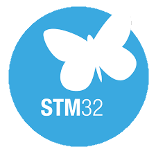

[![Contributors][contributors-shield]][contributors-url]
[![Forks][forks-shield]][forks-url]
[![Stargazers][stars-shield]][stars-url]
[![Issues][issues-shield]][issues-url]
[![MIT License][license-shield]][license-url]
[![LinkedIn][linkedin-shield]][linkedin-url]

  

  <h3 align="center">STM32 Embedded Development</h3>

  

    A repo containing examples of embedded systems based on the STM32 micro-controller.
     
     
    I use a Nucleo-F446RE and the STM32CubeIDE for developement but the code should also work on other STM32 based developement boards and platforms.
     
     
    <a href="https://github.com/Vincentho711/STM32-Embedded-Development/issues/new">Report Bug</a>
  

<!-- USAGE EXAMPLES -->
## 📦 Usage

Each project is in a folder. There is a `README.md` in every project to explain what it does and how to set it up.

<!-- LICENSE -->
## 📜 License

Distributed under the MIT License. See `LICENSE` for more information.

 

 <!-- MARKDOWN LINKS & IMAGES -->
<!-- https://www.markdownguide.org/basic-syntax/#reference-style-links -->
[contributors-shield]: https://img.shields.io/github/contributors/Vincentho711/STM32-Embedded-Development?style=for-the-badge
[contributors-url]: https://github.com/Vincentho711/STM32-Embedded-Development/graphs/contributors
[forks-shield]: https://img.shields.io/github/forks/Vincentho711/STM32-Embedded-Development?style=for-the-badge
[forks-url]: https://github.com/Vincentho711/STM32-Embedded-Development/network/members
[stars-shield]: https://img.shields.io/github/stars/Vincentho711/STM32-Embedded-Development?style=for-the-badge
[stars-url]: https://github.com/Vincentho711/STM32-Embedded-Development/stargazers
[issues-shield]: https://img.shields.io/github/issues/Vincentho711/STM32-Embedded-Development?style=for-the-badge
[issues-url]: https://github.com/Vincentho711/STM32-Embedded-Development/issues
[license-shield]: https://img.shields.io/github/license/Vincentho711/STM32-Embedded-Development?style=for-the-badge
[license-url]: https://github.com/Vincentho711/STM32-Embedded-Development/blob/main/LICENSE.txt
[linkedin-shield]: https://img.shields.io/badge/-LinkedIn-black.svg?style=for-the-badge&logo=linkedin&colorB=555
[linkedin-url]: https://www.linkedin.com/in/vincent-ho-b0932b138/
